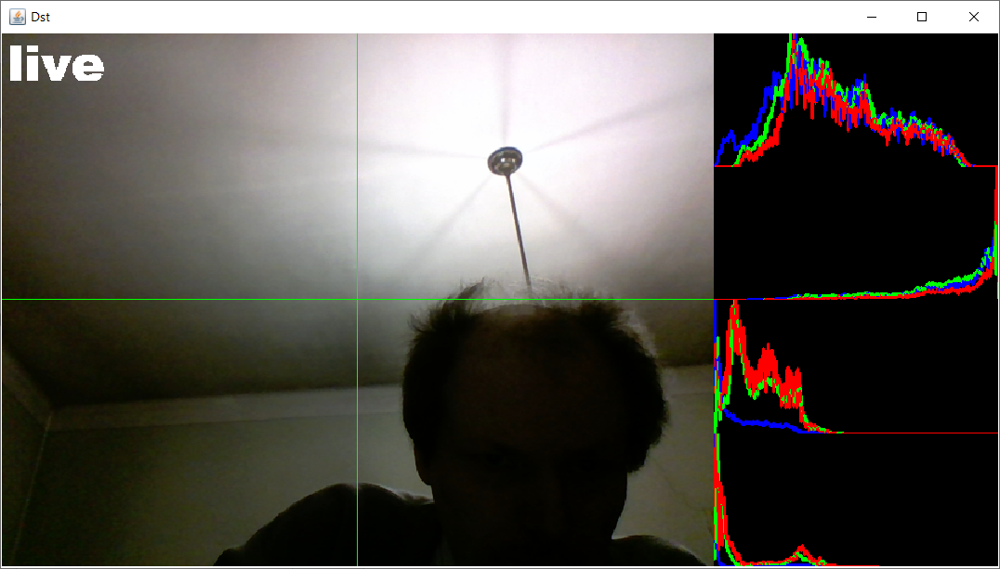

# Histogram

## HistogramWork.java
- compute histogram
- luminosity histogram
- BGR histogram
- draw histogram as image

## VideoFrameHistoSplit.java
- using Regions Of Interest (ROI)
- split source frame in 4 ROIs
- draw separation lines
- compute and draw histogram for each region
- assemble results in one composed destinations frame with 5 ROIs
- add a simple logo to frames

